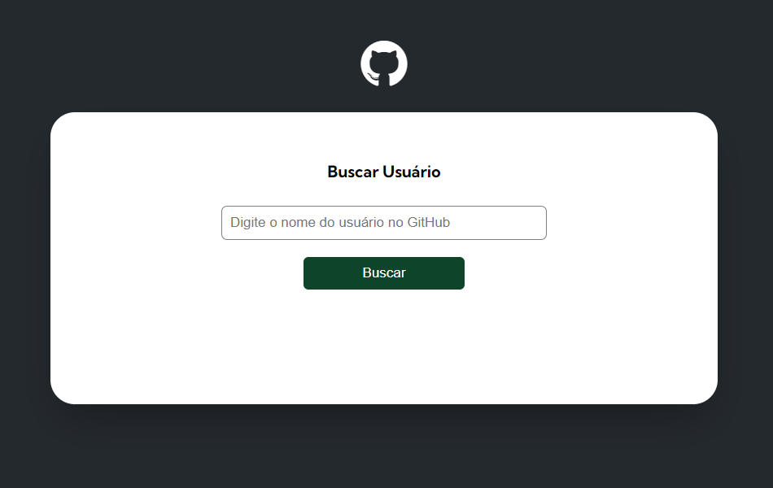

# Github-api-ded-project

## Table of contents

- [Overview](#overview)
  - [Screenshot](#screenshot)
  - [Links](#links)
- [My process](#my-process)
  - [Built with](#built-with)
  - [What I learned](#what-i-learned)

## Overview

### Screenshot



## My process

### Built with

- Semantic HTML5 markup
- CSS custom properties
- Flexbox
- CSS Grid
- Mobile-first workflow

### What I learned

I honed my skills by consuming APIs, importing and exporting modules, creating validations and ordering functions.
I improved my ability to organize tasks with multiple refactorings in my code. The division of responsibilities was one of the most valuable things I improved when building this project.

```html
<h1>...</h1>
```

```css
.loremClass {
  propiety: "value";
}
```

```js
const loremFunction = () => {
  console.log("🎉");
};
```
